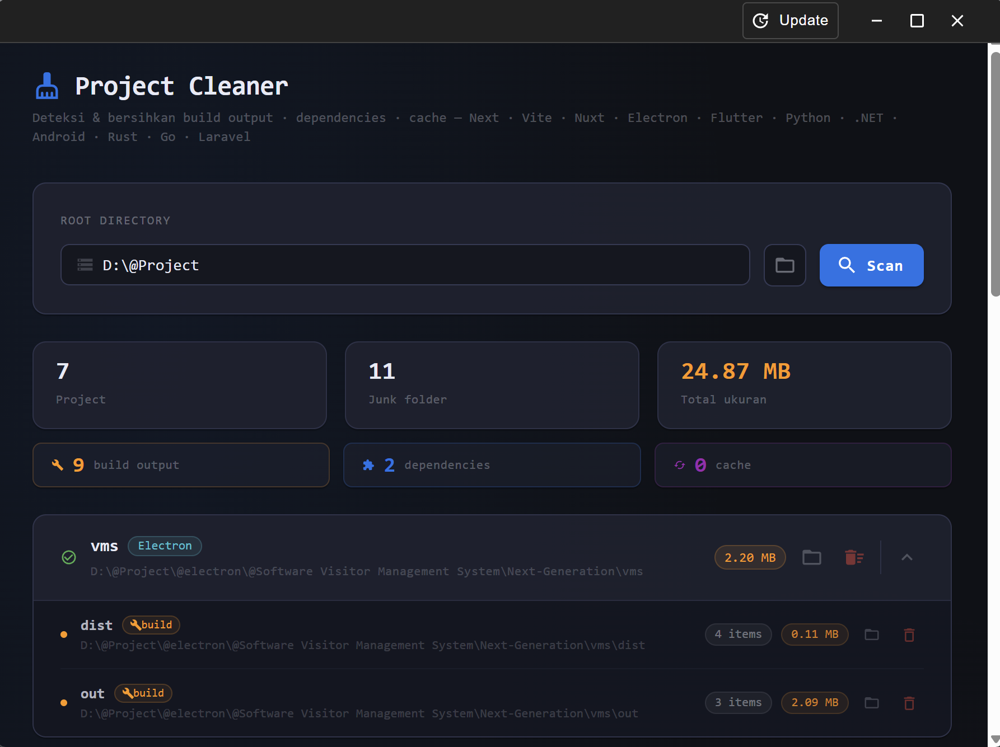

<div align="center">

# 🧹 Project Cleaner

**Deteksi & bersihkan junk folder dari project development Anda**

[](LICENSE)
[](https://github.com/yourusername/ptools/releases)
[](https://github.com/yourusername/ptools/releases)

[Download](#-download) • [Features](#-features) • [Usage](#-usage) • [Tech Stack](#-tech-stack)

</div>

---

## 📖 Tentang

**Project Cleaner** adalah desktop application yang membantu developer membersihkan junk folder dari berbagai project development secara massal. Aplikasi ini secara otomatis mendeteksi dan menghapus folder seperti `node_modules`, `dist`, `build`, `.next`, cache, dan lainnya yang seringkali memakan space disk sangat besar.

### ✨ Features

- 🔍 **Auto-detection** - Otomatis mendeteksi junk folder dari berbagai framework/tools:
  - **Build Output**: `dist`, `build`, `out`, `.next`, `.nuxt`, `.vite`, dll
  - **Dependencies**: `node_modules`, `vendor`, `packages`, dll
  - **Cache**: `.cache`, `.turbo`, `.parcel-cache`, `__pycache__`, dll

- 🎯 **Multi-Framework Support**:
  - Frontend: Next.js, Nuxt, Vite, React, Vue, Angular
  - Mobile: Flutter, React Native, Android (Gradle)
  - Backend: Laravel, .NET, Python, Go, Rust
  - Desktop: Electron
  
- 📊 **Visual Dashboard**:
  - Lihat total space yang bisa dibebaskan
  - Kategorisasi junk folder berdasarkan tipe
  - Detail per-project dengan ukuran file
  
- 🗑️ **Smart Deletion**:
  - Hapus per folder atau seluruh project sekaligus
  - Konfirmasi sebelum menghapus
  - Progress indicator saat menghapus
  
- 📁 **Quick Access**:
  - Buka folder project langsung dari app
  - Browse dan pilih directory dengan mudah
  - Cross-platform file explorer integration

## 📸 Screenshots

<div align="center">
  
  <p><i>Interface utama dengan hasil scan</i></p>
</div>

## 💾 Download

Download versi terbaru untuk platform Anda:

### Windows
[](https://github.com/MhmmdSyahputra/ptools_desktopapp/releases/download/v1.0.0/PTools-Setup-1.0.0.exe)

### macOS
[](https://github.com/yourusername/ptools/releases/latest/download/PTools-1.0.0.dmg)

### Linux
[](https://github.com/yourusername/ptools/releases/latest/download/PTools-1.0.0.AppImage)

> 📦 **Lihat semua versi**: [GitHub Releases](https://github.com/yourusername/ptools/releases)

## 🚀 Usage

1. **Launch aplikasi** - Buka Project Cleaner
2. **Pilih root directory** - Browse atau ketik path folder yang berisi project-project Anda
3. **Scan** - Klik tombol "Scan" dan tunggu proses deteksi selesai
4. **Review** - Lihat hasil scan dan detail junk folder yang ditemukan
5. **Delete** - Hapus folder yang tidak diperlukan (per-item atau bulk delete)

### Tips

- 💡 Scan folder parent yang berisi banyak project untuk hasil maksimal
- 💡 Result akan menampilkan estimasi space yang bisa dihemat
- 💡 Aman dihapus - semua folder yang terdeteksi bisa di-regenerate/reinstall
- 💡 Backup penting: Pastikan Anda sudah commit/push code sebelum menghapus

## 🛠️ Tech Stack

- **Framework**: [Electron](https://www.electronjs.org/) + [Vite](https://vitejs.dev/)
- **Frontend**: [React](https://react.dev/) 19
- **UI Library**: [Material-UI](https://mui.com/) (MUI) v7
- **Router**: [React Router](https://reactrouter.com/) v7
- **Styling**: [Emotion](https://emotion.sh/) + [Styled Components](https://styled-components.com/)
- **Build Tool**: [electron-builder](https://www.electron.build/)

## 👨‍💻 Development

### Prerequisites

- Node.js 18+ 
- npm atau yarn

### Setup Development

```bash
# Clone repository
git clone https://github.com/yourusername/ptools.git
cd ptools

# Install dependencies
npm install

# Run development mode
npm run dev
```

### Build

```bash
# Build untuk Windows
npm run build:win

# Build untuk macOS
npm run build:mac

# Build untuk Linux
npm run build:linux
```

### Project Structure

```
ptools/
├── src/
│   ├── main/           # Main process (Electron)
│   │   ├── index.js
│   │   ├── window.js
│   │   ├── ipc/        # IPC handlers
│   │   └── services/   # Backend services
│   ├── preload/        # Preload scripts
│   └── renderer/       # Renderer process (React)
│       └── src/
│           ├── components/
│           ├── pages/
│           └── routes/
├── resources/          # App resources
└── build/             # Build configs
```

## 🤝 Contributing

Contributions are welcome! Silakan buka issue atau submit pull request.

1. Fork repository ini
2. Buat feature branch (`git checkout -b feature/AmazingFeature`)
3. Commit changes (`git commit -m 'Add some AmazingFeature'`)
4. Push ke branch (`git push origin feature/AmazingFeature`)
5. Buat Pull Request

## 📝 License

Distributed under the MIT License. See `LICENSE` file for more information.

## 🙏 Acknowledgments

- Icons by [Material Design Icons](https://mui.com/material-ui/material-icons/)
- Built with [Electron Vite](https://electron-vite.org/)

---

<div align="center">

**Made with ❤️ for developers who love clean disk space**

[⬆ Back to top](#-project-cleaner)

</div>
